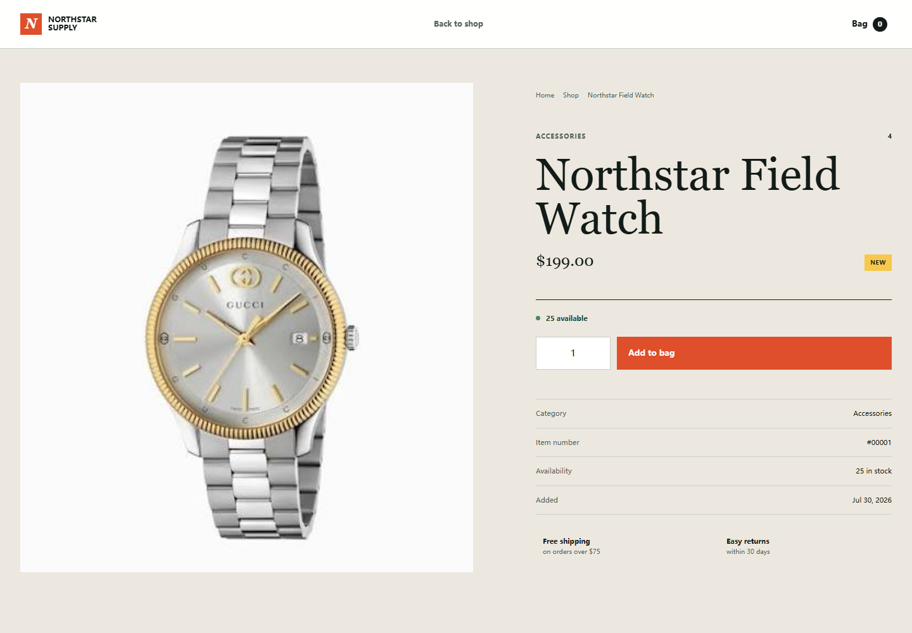
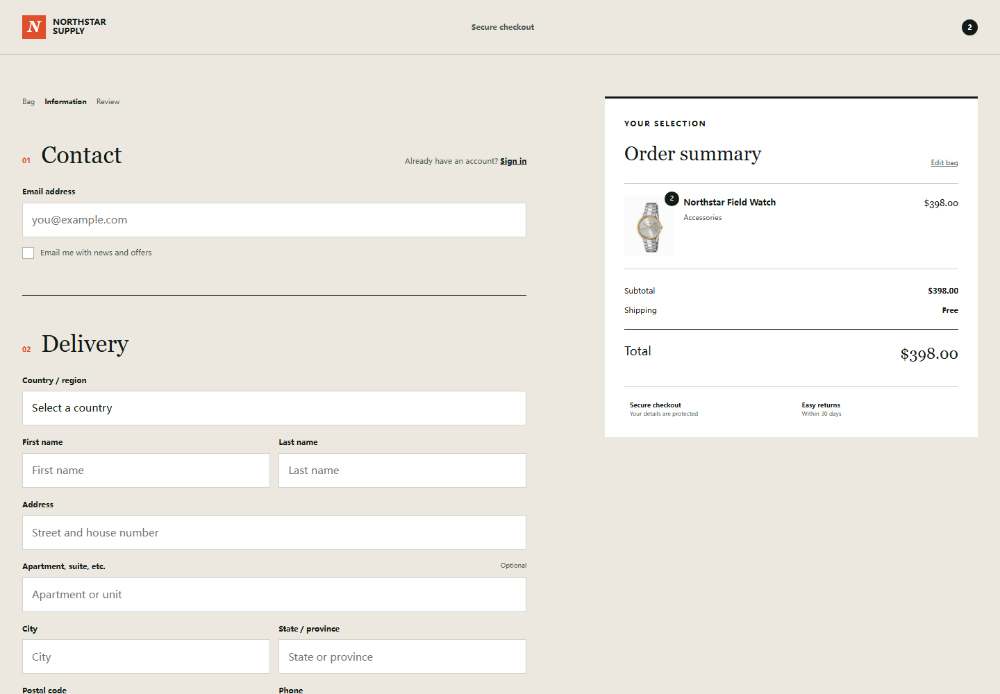

# Northstar Supply

Northstar Supply is a responsive single-store e-commerce project with a React frontend and an Express/MySQL backend. It includes authentication, database-backed products, product reviews, a persistent shopping bag, and a complete checkout interface.

[GitHub Repository](https://github.com/Leon202503/onlineTradePage)

## Preview

### Product Details



### Checkout



## Backend Implementation - My Work

I designed and wrote the Express/MySQL backend used by this project. The frontend does not rely on hard-coded product data: active products, product details, ratings, and reviews are loaded from MySQL through Express endpoints.

The backend currently includes:

- Customer registration with server-side validation
- Password hashing with `bcryptjs` using 12 salt rounds
- Parameterized SQL queries to reduce SQL injection risk
- Customer login with password verification
- Session regeneration after login to establish authenticated state
- Session status checks and logout handling
- Product listing loaded from the `products` table
- Individual product details loaded by product ID
- Review loading and average-rating calculation
- Rating breakdown calculation for scores from 1 to 5
- Authenticated review submission with input validation
- Consistent JSON responses and HTTP status codes

Example authentication flow:

```javascript
const [customers] = await db.promise().query(sql, [email]);
const passwordMatches = await bcrypt.compare(password, customers[0].password);

req.session.regenerate(error => {
  if (error) {
    return res.status(500).json({ message: "Session error" });
  }

  req.session.user = {
    id: customers[0].id,
    firstName: customers[0].first_name,
    lastName: customers[0].last_name,
    email: customers[0].email
  };

  req.session.save(saveError => {
    if (saveError) {
      return res.status(500).json({ message: "Session save failed" });
    }

    return res.redirect(303, "/");
  });
});
```

Example product-detail response structure:

```json
{
  "success": true,
  "product": {
    "id": 1,
    "name": "Northstar Field Watch",
    "price": 199,
    "rating": 4,
    "reviewSummary": {
      "average": 4,
      "total": 2,
      "breakdown": {
        "1": 0,
        "2": 0,
        "3": 1,
        "4": 0,
        "5": 1
      }
    },
    "reviews": []
  }
}
```

## Frontend Features

- Responsive storefront for desktop and mobile
- Dynamic product loading from MySQL
- Category filtering, search, and sorting
- Product detail page with stock and rating information
- Review list, rating summary, and review submission dialog
- Shopping bag stored in `localStorage`
- Quantity controls and subtotal calculation
- Free-shipping progress indicator
- Checkout form with contact, address, shipping, and payment sections
- Registration and sign-in pages
- Signed-in account popover

## Technology Stack

- HTML5
- CSS3
- React 19
- React Router
- Vite
- Lucide React
- Node.js
- Express 4
- MySQL / `mysql2`
- `bcryptjs`
- `express-session`
- Lucide icons

## Project Structure

```text
04-onlineTrade/
|-- bin/
|   `-- www
|-- client/
|   |-- public/
|   |-- src/
|   |   |-- components/
|   |   |-- context/
|   |   |-- pages/
|   |   |-- services/
|   |   `-- utils/
|   |-- package.json
|   `-- vite.config.js
|-- docs/
|   `-- screenshots/
|-- public/
|   |-- images/products/
|   |-- javascripts/
|   |   |-- auth.js
|   |   |-- checkout.js
|   |   |-- product.js
|   |   `-- shop.js
|   |-- stylesheets/
|   |   |-- auth.css
|   |   |-- checkout.css
|   |   |-- product.css
|   |   `-- style.css
|   |-- checkout.html
|   |-- index.html
|   |-- login.html
|   |-- product.html
|   `-- register.html
|-- routes/
|   `-- index.js
|-- app.js
|-- db.js
|-- package.json
`-- README.md
```

## Database Model

The application uses these main tables:

```text
customers        Registered customer accounts
products         Product information, prices, stock, and status
product_reviews  Product ratings and written reviews
addresses        Customer delivery addresses (planned order flow)
orders           Order header and delivery snapshot (planned order flow)
order_items      Products and price snapshots in an order (planned order flow)
```

Main relationships:

```text
customers  1 ---- N  product_reviews
products   1 ---- N  product_reviews
customers  1 ---- N  addresses
customers  1 ---- N  orders
orders     1 ---- N  order_items
products   1 ---- N  order_items
```

## API Endpoints

| Method | Endpoint | Description | Status |
| --- | --- | --- | --- |
| `POST` | `/api/register` | Validate and register a customer | Implemented |
| `POST` | `/api/login` | Verify credentials and create a session | Implemented |
| `GET` | `/api/check-login` | Return the current login state | Implemented |
| `POST` | `/api/logout` | Destroy the current session | Implemented |
| `GET` | `/api/getProducts` | Return active products | Implemented |
| `GET` | `/api/getProduct?id=1` | Return one product with reviews | Implemented |
| `POST` | `/api/addReview` | Add an authenticated product review | Implemented |
| `POST` | `/api/createOrder` | Create an order and update stock | In progress |

## Installation

```bash
git clone https://github.com/Leon202503/onlineTradePage.git
cd onlineTradePage
npm install
cd client
npm install
```

Create a MySQL database named `onlinetrade`, create the required tables, and configure the local connection in `db.js`.

Start Express in the project root:

```bash
npm start
```

Start React in a second terminal:

```bash
cd client
npm run dev
```

Open [http://localhost:5173](http://localhost:5173). Vite proxies `/api` requests to Express on port `3000`.

## Security Notes

- Passwords are stored as bcrypt hashes, not plain text.
- SQL values are passed through placeholders.
- Password hashes are never stored in the session.
- The session cookie uses `httpOnly` and `sameSite=lax`.
- Database credentials and `SESSION_SECRET` should be supplied through environment variables before deployment.
- The default in-memory session store is suitable only for development.
- Production deployment should use HTTPS, secure cookies, and a persistent session store.

## Next Steps

- Implement `/api/createOrder` with a MySQL transaction
- Save address, order, and order-item records
- Validate product prices and stock on the server
- Update stock atomically when an order is created
- Add customer order-history pages
- Add duplicate-email handling during registration
- Move database credentials into environment variables

---

# 中文介绍

Northstar Supply 是一个单店铺英文购物网站，前端使用 React、React Router 和 Vite，后端使用 Express 与 MySQL。项目已经实现用户认证、数据库商品读取、商品详情、评分评论、购物车和前端结账流程。

## 后端代码 - 我的主要工作

本项目的 Express/MySQL 后端由我编写。商品数据并不是写死在前端，而是通过 Express 接口从 MySQL 查询后交给页面显示。

目前已经完成的后端功能包括：

- 用户注册与服务端字段校验
- 使用 `bcryptjs` 对密码进行加密
- 使用 SQL 占位符传递查询参数
- 用户登录与密码校验
- 登录成功后重新生成 Session
- 查询登录状态与退出登录
- 从 `products` 表读取商品列表
- 按商品 ID 查询商品详情
- 从 `product_reviews` 表读取评论
- 计算平均评分和 1 至 5 星评分数量
- 校验登录状态后添加评论
- 根据不同结果返回合适的 HTTP 状态码和 JSON

## 前端功能

- 响应式商品首页
- 商品分类、搜索和排序
- 数据库商品动态展示
- 商品详情、库存和评分信息
- 评论列表和发表评论弹窗
- 使用 `localStorage` 保存购物车
- 商品数量与价格计算
- 登录、注册和用户信息悬浮窗
- 收货信息、配送方式和支付方式结账页面

## 当前接口

| 方法 | 路径 | 功能 | 状态 |
| --- | --- | --- | --- |
| `POST` | `/api/register` | 注册用户 | 已完成 |
| `POST` | `/api/login` | 登录并创建 Session | 已完成 |
| `GET` | `/api/check-login` | 查询登录状态 | 已完成 |
| `POST` | `/api/logout` | 退出登录 | 已完成 |
| `GET` | `/api/getProducts` | 查询商品列表 | 已完成 |
| `GET` | `/api/getProduct?id=1` | 查询商品详情和评论 | 已完成 |
| `POST` | `/api/addReview` | 添加商品评论 | 已完成 |
| `POST` | `/api/createOrder` | 创建订单并扣减库存 | 开发中 |

## 运行项目

```bash
npm install
npm start
```

再打开第二个终端启动 React：

```bash
cd client
npm install
npm run dev
```

然后访问：

```text
http://localhost:5173
```

## 后续计划

- 使用 MySQL 事务完成创建订单接口
- 写入地址、订单和订单商品明细
- 在服务端重新校验价格与库存
- 下单时安全扣减库存
- 完成用户订单历史页面
- 使用环境变量保存数据库配置和 Session 密钥

## License

This project is licensed under the ISC License.
